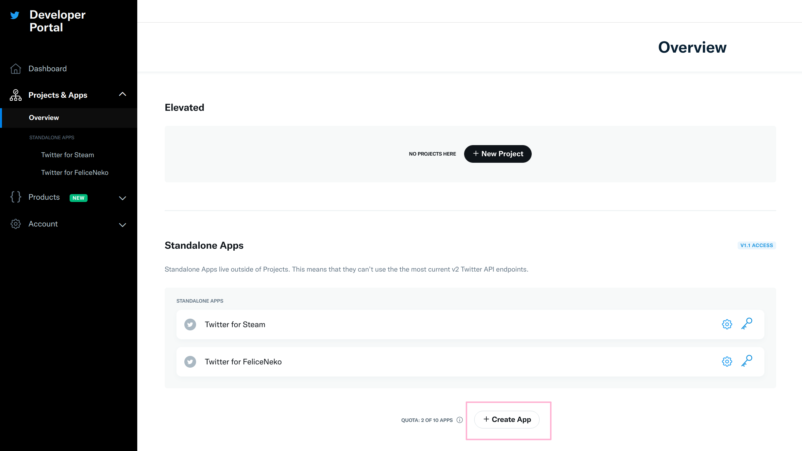
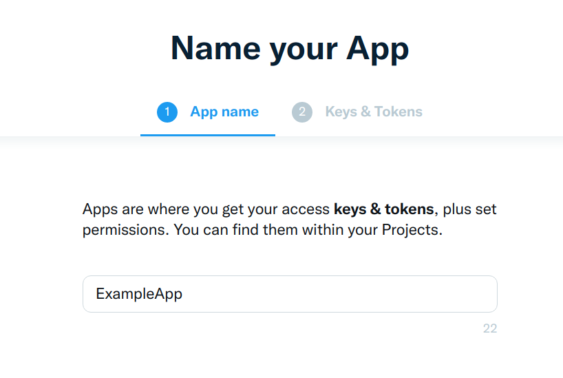
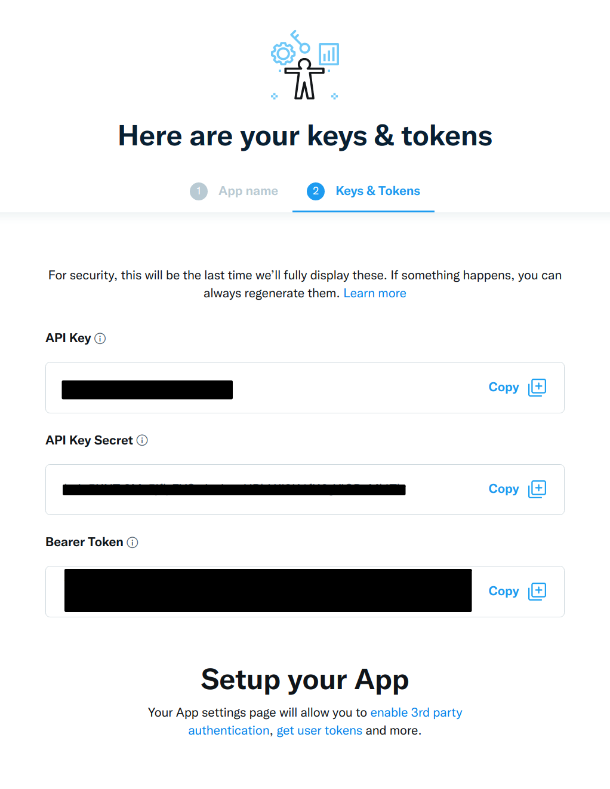
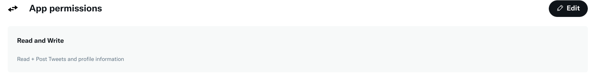
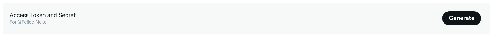

# Simple tweet sender
A simple tweet sender

## Setup
First clone this repo ```git clone https://github.com/Felice-Neko/Simple-tweet-sender.git```

Then go to the [twitter developer website](https://developer.twitter.com/). Apply for a developer account. After your developer account got approved, you need to make an application.



Name your app.



Copy your API Key and API Key Secret to auth.py



Edit App permissions from ```Read Only``` to ```Read and Write```.



Go to ```Keys and tokens``` and generate ```Access Token and Sercret```.



Copy your Access Token and Access Toke Secret to auth.py


## Usage

Run twitter.py ```python twitter.py``` or in vs code hit F5 (with the python extention installed). If it doesn't run make sure python and twython are installed.
> The command to install twython is ```pip install twython```

>Note: this is my first time writing a doc, sorry if it's bad
